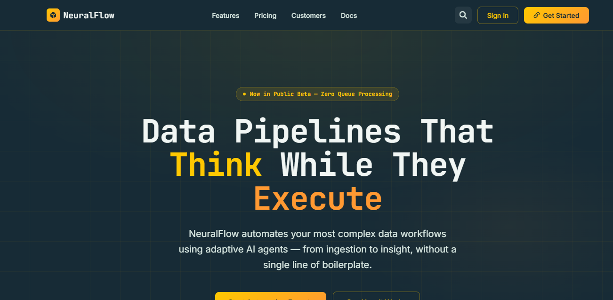

# NeuralFlow – AI Data Automation Platform

A premium, responsive SaaS landing page for **NeuralFlow**, an AI-powered data automation platform. Built as part of a frontend engineering challenge with a strong focus on performance, accessibility, semantic HTML, responsive design, and isolated state management.

---

## 🚀 Live Demo

**Website:** [https://your-live-link.vercel.app](https://srikarl123.github.io/NeuralFLow/)

---

## 📂 GitHub Repository

[https://github.com/yourusername/neuralflow](https://github.com/SrikarL123/NeuralFlow)

---

## ✨ Features

### 🎯 Hero Section

* Premium AI SaaS landing page
* Animated hero badge
* Gradient background effects
* CTA buttons
* Company statistics
* Responsive layout

### 🏢 Trusted By Section

* Infinite marquee animation
* Hover pause effect
* Modern brand showcase

### 🧩 Responsive Features Section

* Bento Grid layout on desktop
* Accordion layout on mobile
* Active state preservation during viewport changes
* Smooth CSS-powered transitions
* Accessible keyboard navigation

### 💰 Dynamic Pricing Engine

* Monthly / Annual billing toggle
* Three supported currencies:

  * ₹ INR
  * $ USD
  * € EUR
* Dynamic pricing using a configuration matrix
* Automatic 20% annual discount calculation
* Localized DOM updates for better performance

### ⭐ Testimonials

* Customer reviews
* Interactive cards
* Responsive grid layout

### 📱 Responsive Navigation

* Sticky navigation bar
* Mobile hamburger menu
* Full-screen mobile navigation
* Smooth scrolling

### 🎨 UI & Motion

* Custom CSS animations
* Hardware-accelerated transitions
* Gradient effects
* Hover micro-interactions
* Loading animation
* Responsive layouts

---

## 🛠️ Tech Stack

* HTML5
* CSS3
* Vanilla JavaScript
* CSS Variables
* CSS Grid
* Flexbox
* Web Animations
* Semantic HTML

---

## 📋 Project Highlights

* Responsive across Desktop, Tablet, and Mobile
* Semantic HTML structure
* SEO-friendly metadata
* Open Graph & Twitter meta tags
* Accessible components
* Custom CSS architecture
* Dynamic pricing calculations
* Mobile-first responsive design
* Performance-oriented animations
* Zero external UI libraries

---

## ⚡ Performance Optimizations

* CSS variables for efficient styling
* Hardware-accelerated animations
* Lightweight Vanilla JavaScript
* Optimized DOM updates
* Responsive image handling
* Smooth scrolling
* Optimized transition timing

---

## ♿ Accessibility

* Semantic HTML elements
* ARIA labels
* Keyboard-friendly navigation
* Accessible accordion
* Screen reader support
* Responsive typography
* Focus management

---

## 📁 Project Structure

```text
NeuralFlow/
│
├── index.html
├── README.md
└── assets/
    ├── svg/
    ├── fonts/
    └── images/
```

---

## 🚀 Running Locally

1. Clone the repository

```bash
git clone https://github.com/yourusername/neuralflow.git
```

2. Open the project

```bash
cd neuralflow
```

3. Launch the project

Simply open **index.html** in your browser.

Or use VS Code Live Server:

```bash
Right Click → Open with Live Server
```

---

## 📱 Responsive Breakpoints

| Device  | Layout           |
| ------- | ---------------- |
| Desktop | Bento Grid       |
| Tablet  | Responsive Grid  |
| Mobile  | Accordion Layout |

---

## 🎯 Challenge Requirements Covered

* ✅ Premium AI SaaS Landing Page
* ✅ Hero Section
* ✅ Bento Grid Features
* ✅ Mobile Accordion
* ✅ Matrix-Based Pricing
* ✅ Monthly / Annual Toggle
* ✅ Multi-Currency Pricing
* ✅ Responsive Design
* ✅ Semantic HTML
* ✅ SEO Optimization
* ✅ CSS Animations
* ✅ Accessible Components
* ✅ Public Deployment Ready

---

## 📄 License

This project was created for a frontend engineering assessment and is intended for educational and evaluation purposes.

---

## 👨‍💻 Author

**Srikar Lokai**

* GitHub: [https://github.com/SrikarL123](https://github.com/SrikarL123)
* LinkedIn: [https://linkedin.com/in/srikar-lokai](https://linkedin.com/in/srikar-lokai)

---

# 📸 Preview



---

This README is concise, professional, and suitable for a recruiter or judge reviewing your submission. It highlights the implemented features without making claims that aren't directly supported by the project.
